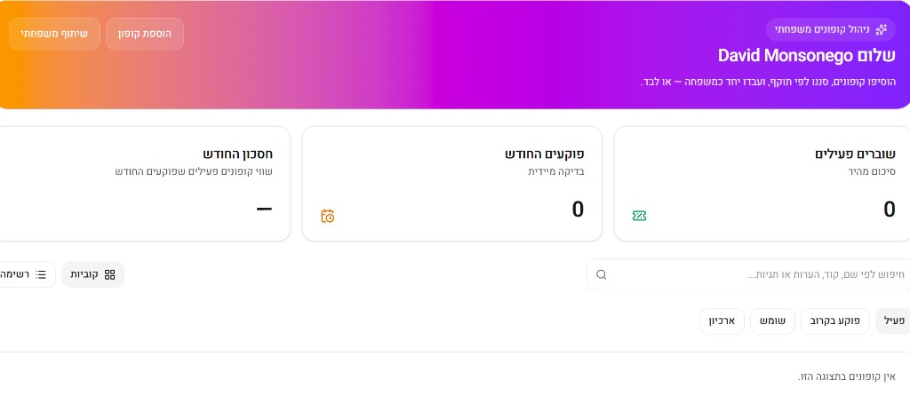
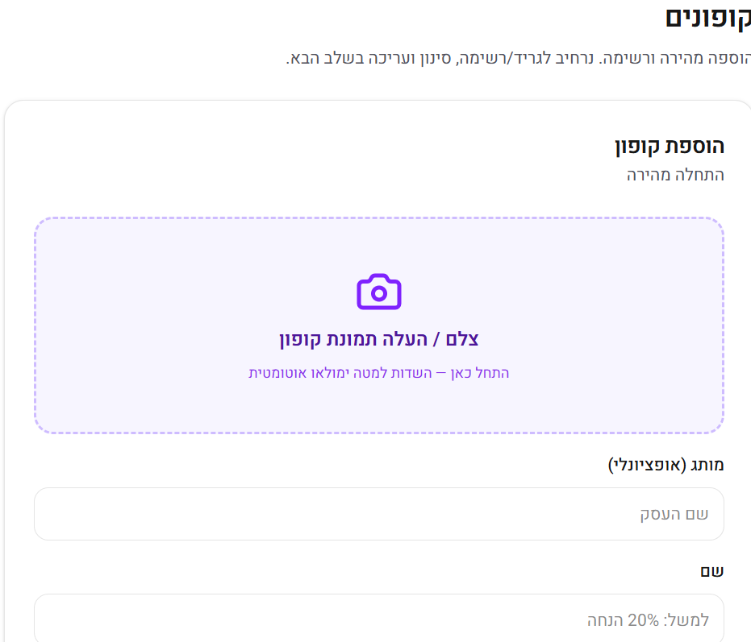

# קופונים למשפחה · Coupons Tracker

Hebrew RTL web app for managing household coupons together — or in a private solo account.

**Live app:** [https://coupons-tracker-six.vercel.app](https://coupons-tracker-six.vercel.app)

**Repository:** [github.com/DudiMonsonego/Coupons_Tracker](https://github.com/DudiMonsonego/Coupons_Tracker)

## Screenshots

### Dashboard

Family dashboard with stats, search, filters (active / expiring soon / used / archive), and grid or list view.



### Add coupon

Quick add with photo upload; AI fills fields from the coupon image.



## Features

- Google sign-in and household onboarding
- **Family sharing** — all members in the same household can view, edit, and delete shared coupons (Supabase RLS by `household_id`)
- Optional **solo account** switch for private coupons
- Coupon CRUD: notes, tags, used/archive, categories, value/cost, brand logo
- Image upload and AI import (GPT vision)
- Daily expiry reminders (Edge Function + SMTP)
- Owner-only family invites

## Tech stack

- [Next.js](https://nextjs.org) 16 (App Router), React, TypeScript
- [Supabase](https://supabase.com) (Auth, Postgres, Storage)
- [shadcn/ui](https://ui.shadcn.com) + Tailwind CSS (RTL)

## Getting started

```bash
cd coupons-tracker
npm install
cp .env.example .env
# Fill Supabase keys and optional OPENAI_API_KEY
npm run dev
```

Open [http://localhost:3000](http://localhost:3000).

Apply database schema: run `supabase/apply-all-schema.sql` and migrations in the Supabase SQL Editor (see [DEPLOY.md](./DEPLOY.md)).

## Documentation

| Doc | Description |
|-----|-------------|
| [DEPLOY.md](./DEPLOY.md) | Vercel, env vars, Supabase & Google OAuth |
| [docs/SECURITY-RLS.md](./docs/SECURITY-RLS.md) | Family multi-tenancy and RLS policies |

## Deploy

Deploy on [Vercel](https://vercel.com) with **Root Directory** set to `coupons-tracker`. Set `NEXT_PUBLIC_SITE_URL` to your production URL (e.g. `https://coupons-tracker.vercel.app`). Details in [DEPLOY.md](./DEPLOY.md).

## License

Private project — all rights reserved unless stated otherwise.
